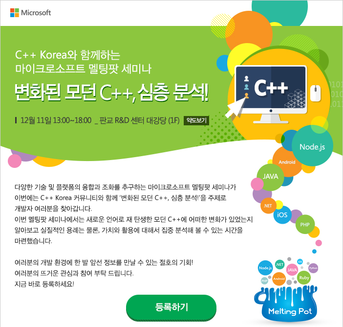

# C++ Korea 제1회 세미나 - "변화된 모던 C++, 심층 분석!"

###### 2014년 12월 11일에 진행되었던 C++ Korea 1회 세미나 발표 자료 및 예제 코드

## 프로그램

- 13:00 ~ 13:30 : 등록
- 13:30 ~ 13:40 : 인사말
- 13:40 ~ 14:50 : 세션 1 (불어오는 변화의 바람, From C++98 to C++11 and C++14)
- 14:50 ~ 15:10 : 휴식
- 14:10 ~ 15:00 : 세션 2 (심층 분석 Part 1, Rvalue Reference(Move Semantics) and constexpr)
- 16:20 ~ 16:40 : 휴식
- 15:10 ~ 15:40 : 세션 3 (심층 분석 Part 2, Lambda Expression과 Concurrency API)
- 17:50 ~ 18:00 : 휴식

## 아젠다 및 발표자 소개

### 세션 1 - 불어오는 변화의 바람, From C++98 to C++11 and C++14

C++98이 출시된 이후, 오랜 기간 끝에 C++11이 출시되고 올해 8월, C++14 최종 버전이 제출되었습니다. 또한 다음 표준인 C++17을 위한 작업이 이미 시작되었습니다. C++11/14는 C++98에 비해 큰 변화가 있었기에 모던 C++이라는 다른 이름으로 부르고 있습니다. C++ 프로그래머가 가장 많이 사용하는 C++ IDE인 Visual C++의 최신 버전(Visual Studio 2015 Preview)을 기준으로 C++98에서 C++11/14에서는 무엇이 변화되었는지, 그리고 모던 C++의 코딩 스타일이란 무엇인지 정리해 봅니다.

#### 발표자

- 옥찬호. https://github.com/utilForever
- KAIST 전산학과 석사과정 재학 중
- C++ Korea 그룹 관리자
- 역서
  - 게임샐러드로 코드 한 줄 없이 게임 만들기
  - 유니티 Shader와 Effect 제작
  - 2D 게임 프로그래밍

### 세션 2 - 심층 분석 Part 1, Rvalue Reference(Move Semantics) and constexpr

C++11에 새롭게 추가된 문법적 기능과 의미론적 특성 중에 Rvalue Reference와 Move Semantics는 성능과 표현 방식에 있어서 큰 변화 중 하나로 꼽을 수 있을 것입니다. 본 세션에서는 이에 대한 의미를 명쾌하게 규정하고 실질적인 용례를 같이 살펴보고자 합니다. 더불어 컴파일 타임 처리를 위한 constexpr도 같이 살펴 봅니다.

#### 발표자

- 김경진. https://devmachine.blog.me
- Microsoft MVP (Visual C++)
- 저서
  - PPL을 이용한 VC++ 병렬 프로그래밍

### 세션 3 - 심층 분석 Part 2, Lambda Expression과 Concurrency API

C++11에 추가된 Lambda Expression의 특징과 내용을 살펴보고, 실용적인 관점에서 Lambda Expression의 장점과 그 활용 예를 살펴보고자 합니다. 또한, 그동안 플랫폼별 API를 사용할 수 밖에 없었던 multi-thread, concurrency programming을 할 때 활용할 수 있는 C++ 표준 Concurrency API의 구조와 용례를 알아봅니다.

#### 발표자

- 김명신.
- 마이크로스프트 아태지역 글로벌 핵심 개발자 지원팀 수석 엔지니어
- 마이크로소프트 고객기술지원부 전략 참모
- NHN, STI 소프트웨어 아키텍트
- C/C++ 및 C# 부문 마이크로소프트 MVP
- 분산컴퓨팅 아키텍처, 네트워킹, 프로그래밍 방법론, 소프트웨어 공학 전문가
- 저서
  - Advanced C Programming
  - Unix System V
- 역서
  - Windows via C/C++
  - Effective C#
  - CLR via C#

행사 관련 문의는 utilforever@gmail.com 으로 해주시기 바랍니다.