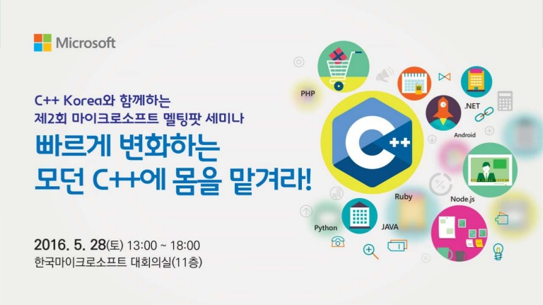

# C++ Korea 제2회 세미나 - "빠르게 변화하는 모던 C++에 몸을 맡겨라!"

###### 2016년 5월 28일에 진행되었던 C++ Korea 2회 세미나 발표 자료 및 예제 코드

## 프로그램

- 13:00 ~ 13:30 : 등록
- 13:30 ~ 13:40 : C++ Korea 및 멜팅팟 세미나 소개
- 13:40 ~ 14:10 : 세션 1 (May Microsoft be with C++ Developers)
- 14:10 ~ 15:20 : 휴식
- 14:20 ~ 15:20 : 세션 2 (C++17 Key Features Summary)
- 15:20 ~ 15:30 : 휴식
- 15:30 ~ 16:30 : 세션 3 (Ranges for The C++ Standard Library)
- 16:30 ~ 16:40 : 휴식
- 16:40 ~ 17:40 : 세션 4 (C++ String 파고들기)
- 17:40 ~ 18:00 : 맺음말 & 경품 추첨

## 아젠다 및 발표자 소개

### 세션 1 - May Microsoft be with C++ Developers

그간 마이크로소프트는 모던 C++ 표준화의 노력과 더불어 Visual Studio를 중심으로 C++ 개발자들의 생산성을 높이기 위한 다양하고 편리한 기능을 제공하기 위해서 최선의 노력을 다하고 있습니다. 이번 세션에서는 C++ 개발자의 관점에서 Visual Studio에 신규로 추가된 주요 기능들을 Demo와 함께 알아보고자 합니다. C++ 개발자여, Microsoft와 함께 하시길!

#### 발표자

- 김명신.
- 한국 마이크로소프트 부장, 기술 에반젤리스트
- 전) Microsoft 동아시아 핵심 개발자 지원팀 수석
- 저서
  - Advanced C Programming
  - Unix System V
- 역서
  - 마스터링 Microsoft Azure IaaS
  - CLR via C#
  - Windows via C/C++
  - Effective C#

### 세션 2 - C++17 Key Features Summary

C++은 10년 만에 C++11/14를 발표하면서 '모던 C++'이라는 이름으로 발전했습니다. 그만큼 새로운 기능들이 많이 추가되었습니다. 그리고 2017년, C++은 C++17이라는 이름으로 또 한번의 발전을 준비하고 있습니다. 3년 주기로 빠르게 변화하는 모던 C++에 대비하기 위해 C++17에 추가될 주요 기능들을 살펴보고자 합니다.

#### 발표자

- 옥찬호. https://github.com/utilForever
- Nexon Korea 클라이언트 프로그래머
- Microsoft Visual C++ MVP
- C++ Korea 그룹 대표
- 역서
  - 게임샐러드로 코드 한 줄 없이 게임 만들기
  - 유니티 Shader와 Effect 제작
  - 2D 게임 프로그래밍

### 세션 3 - Ranges for The C++ Standard Library

데이터들 중 일부분을 나열하거나, 그룹 짓거나, 특정 데이터만 추출하거나, 데이터의 범위를 다루는 작업은 흔히 있는 일입니다. 그런데 하위 범위의 집합을 또 다른 범위로 표현해야 하는 상황이 생긴다면 어떻게 해야 될까요? 차기 C++ 표준에 포함될 예정인 Ranges Library를 통해 곧 사용하게 될 간결하고 효율적인 범위 표현에 대해 미리 알아봅니다.

#### 발표자

- 최동민.
- Nexon Korea 서버 프로그래머

### 세션 4 - C++ String 파고들기

C++에서 가장 다루기 힘든 부분 중 하나가 바로 문자열일 것입니다. 특히 지역화(Localization)를 고려한 프로그램을 개발할 때에 살펴봐야 할 내용은 더욱 많아집니다. 이를 위해 모던 C++(C++11 ~ 17)에 추가된 다양한 문자열 지원 기능을 살펴보고, 표준에서 지원하지 않는 기능을 활용하기 위한 3rd party 라이브러리를 알아봅니다.

#### 발표자

- 허린.
- NCSoft 서버 프로그래머
- Microsoft Visual C++ MVP
- C++로 게임 서버 개발중

## 안내

- 좌석이 한정되어 있으니 참석을 위해서는 반드시 사전등록을 해주시기 바랍니다.
- 주차권은 지원되지 않습니다. 가급적 대중교통을 이용해주시기 바랍니다.
- 간단한 다과와 음료가 제공됩니다.

## 협찬

- 한국 마이크로소프트
- 한빛미디어
- 에이콘출판사

행사 관련 문의는 utilforever@gmail.com 으로 해주시기 바랍니다.