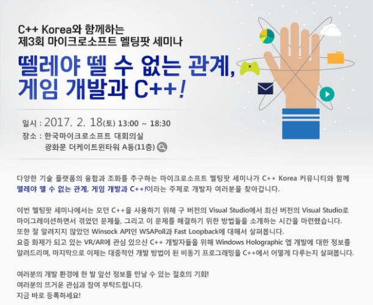

# C++ Korea 제3회 세미나 - "뗄레야 뗄 수 없는 관계, 게임 개발과 C++!"

###### 2017년 2월 18일에 진행되었던 C++ Korea 3회 세미나 발표 자료 및 예제 코드

## 프로그램

- 13:00 ~ 13:30 : 등록
- 13:30 ~ 13:40 : C++ Korea 소개
- 13:40 ~ 14:40 : 세션 1 (새 C++은 새 Visual Studio에? 좌충우돌 마이그레이션 이야기)
- 14:40 ~ 15:50 : 휴식
- 14:50 ~ 15:30 : 세션 2 (잘 알려지지 않은 숨은 진주, Winsock API-WSAPoll, Fast Loopback)
- 15:30 ~ 16:00 : 휴식
- 16:00 ~ 17:00 : 세션 3 (Do it yourself! C++과 DirectX로 Windows Holographic 앱 개발하기)
- 17:00 ~ 17:10 : 휴식
- 17:10 ~ 18:10 : 세션 4 ("데이터야, 너 살아있니?", C++ 비동기 프로그래밍 알아보기)
- 18:10 ~ 18:30 : 맺음말 & 경품 추첨

## 아젠다 및 발표자 소개

### 세션 1 - 새 C++은 새 Visual Studio에? 좌충우돌 마이그레이션 이야기

C++11을 시작으로 모던 C++이 도입된 지도 어느새 6년이라는 시간이 흘렀습니다. 올해는 C++17 표준이 도입될 예정입니다. 그만큼 많이 개선되고 새로운 기능들이 많이 도입되었기에 실무에서 사용해보고 싶은 경우도 많습니다. 하지만 이미 서비스 중이라 기존 프로젝트를 새 버전의 Visual Studio로 마이그레이션하기 어려운 프로젝트가 많습니다. 그렇다고 아예 불가능한 일도 아닙니다. 이번 세미나에서는 기존 프로젝트를 새 버전의 Visual Studio로 마이그레이션하면서 발생했던 문제와 마이그레이션 이후 모던 C++을 사용하면서 발생했던 문제, 그리고 해결법을 설명하고자 합니다. 또한 새 버전의 Visual Studio에 생긴 유용한 기능들도 함께 알려드립니다.

#### 발표자

- 옥찬호. https://github.com/utilForever
- Nexon Korea 클라이언트 프로그래머
- Microsoft Visual Studio and Developer Technologies MVP
- C++ Korea 그룹 대표
- 역서
  - 게임샐러드로 코드 한 줄 없이 게임 만들기
  - 유니티 Shader와 Effect 제작
  - 2D 게임 프로그래밍

### 세션 2 - 잘 알려지지 않은 숨은 진주, Winsock API-WSAPoll, Fast Loopback

웹이 주류가 되면서 Windows API에 대한 관심이 많이 줄어들어 새로운 Win32 API에 대한 정보를 얻기 어려워졌습니다. 한글로 된 Win32 API에 대한 정보는 대부분 Windows XP 이하에 멈춰있어서 Windows Vista 이후 새로 생긴 API에 대한 정보를 얻기 힘든 것이 현실입니다. Windows Vista부터 네트워크와 병렬 프로그래밍에 관련된 API가 많이 추가되고 있는데, 이번 세미나에서는 이 중에서도 네트워크와 관련된 WSAPoll과 Fast Loopback 기능에 대해 설명하고자 합니다. 네트워크 프로그래밍에서 WSAPoll, Fast Loopback 기능을 사용하면 더욱 편리하며 향상된 성능을 얻을 수 있습니다.

#### 발표자

- 최흥배.
- 현) NHN NEXT 게임 프로그래밍 겸임 교수
- 전) 온라인 게임 서버 프로그래머, Microsoft Visual C++ MVP (2009-2011)

### 세션 3 - Do it yourself! C++과 DirectX로 Windows Holographic 앱 개발하기

최근 가상현실(Virtual Reality; VR)과 증강현실(Argumented Reality; AR)에 많은 분들이 관심을 갖고 있습니다. 하지만 어떻게 개발해야 하는지에 대해선 매우 막연하게 느끼시는 분들 또한 많습니다. 그중에서도 Holographic 앱의 개발 방법에 대해선 더더욱 생소할 것입니다. 이번 세션에서는 HoloLens와 곧 출시 예정인 Windows 10 VR 기기들을 위한 Windows Holographic API를 소개합니다. 또한 C++과 DirectX를 이용해 상용 엔진을 사용하지 않고 직접 Windows Holographic 앱을 개발하는 방법을 설명합니다.

#### 발표자

- 유영천. https://megayuchi.wordpress.com
- Microsoft Visual Studio and Developer Technologies MVP

### 세션 4 - "데이터야, 너 살아있니?", C++ 비동기 프로그래밍 알아보기

모바일 게임이 홍수처럼 쏟아지고 있습니다. 모바일 게임은 장르마다 다르긴 하지만, 비동기 방식의 구현을 많이 사용합니다. 이번 세션에서는 요즘 들어 대세가 되고 있는 비동기 프로그래밍에 대해 살펴보고, C++로 구현하는 앞으로의 비동기 프로그래밍에 대해 알아봅니다. 비동기를 구현하기 위한 지금까지의 흐름, 비동기 프로그래밍을 위한 C++ 언어의 새로운 확장과 구현에 대해서 알아봅니다.

#### 발표자

- 허린. https://www.lunapiece.net
- NCSoft 서버 프로그래머
- Microsoft Visual Studio and Developer Technologies MVP

## 안내

- 좌석이 한정되어 있으니 참석을 원하시는 분들은 사전등록을 해주시기 바랍니다.
- 주차권은 지원되지 않습니다. 가급적 대중교통을 이용해주시기 바랍니다.
- 본 행사에 참석하시는 모든 분들께 간단한 다과와 음료가 제공됩니다.

## 협찬

- 한국 마이크로소프트
- 한빛미디어
- 길벗
- 루비페이퍼

행사 관련 문의는 utilforever@gmail.com 으로 해주시기 바랍니다.