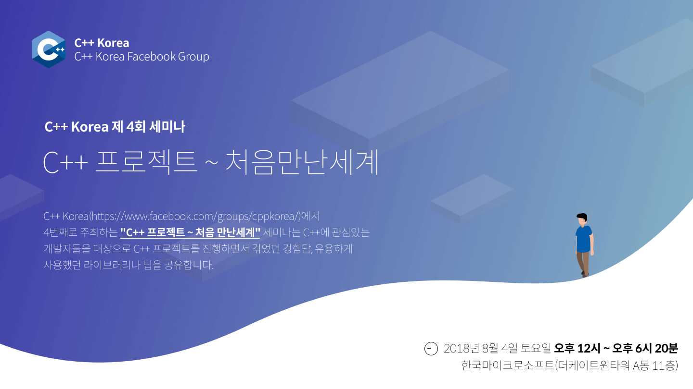

# C++ Korea 제4회 세미나 - "C++ 프로젝트 ~ 처음 만난 세계"

###### 2018년 8월 4일에 진행되었던 C++ Korea 4회 세미나 발표 자료 및 예제 코드

C++ Korea에서 4번째로 주최하는 "C++ 프로젝트 ~ 처음 만난 세계" 세미나는 C++에 관심있는 개발자들을 대상으로 C++ 프로젝트를 진행하면서 겪었던 경험담, 유용하게 사용했던 라이브러리나 팁을 공유합니다.

## 신청 페이지

https://festa.io/events/58

## 프로그램

- 12시 - 13시 : 세미나 등록
- 13시 00분 - 13시 50분 : Session 1
- 13시 50분 - 14시 00분 : 휴식
- 14시 00분 - 14시 50분 : Session 2
- 14시 50분 - 15시 00분 : 휴식
- 15시 00분 - 15시 50분 : Session 3
- 15시 50분 - 16시 00분 : 휴식
- 16시 00분 - 16시 50분 : Session 4
- 16시 50분 - 17시 00분 : 휴식
- 17시 00분 - 17시 50분 : Session 5
- 17시 50분 - 18시 20분 : 경품 추첨 및 마무리

## 아젠다 및 발표자 소개

### 트랙 1

#### Session 1 - 처음 만나는 Modern C++의 세계 (부제 : C++ 표준의 위엄)

- 내용 : C++ 표준(C++11/14)을 사용해 윈도우에서 개발 및 테스트, WSL(Windows Subsystem Linux) 에서 Build, 리눅스 환경에서 운영하는 프로그램을 제작한 경험을 코드를 기반으로 얘기해 보고자 합니다. 매크로로 점철된 이전 세대의 크로스 플랫폼이 아닌 표준을 준수하는 것만으로도 윈도우, 리눅스 모두에서 훌륭하게 동작하는 프로그램을 어떻게 만들 수 있는지 알려드립니다. (덤으로 CMake, cURL이 등장합니다.)

- 강연자 이력
    - 장정철 / SK Telecom
    - T map Route Plan 서버 프로그래머
    - 다크에덴, 마계촌 온라인, KUF2 서버 프로그래머

#### Session 2 - C++ 선형대수학 입문

- 내용 : 공학에서 선형대수학을 사용하는 분야들은 높은 성능을 필요로 합니다. 그렇다면 C++ 에서 어떻게 하면 빠르게 행렬 연산들을 계산할 수 있을까요? 이번 세션에서는 C++에서 선형대수학을 효율적으로 계산하기 위해 알아야 할 지식들을 알려드립니다. 기초적으로 선형대수학 연산의 몇 가지 이슈들과 성능을 분석하는 방법을 설명하고, OpenBLAS, LAPACK 등의 로우 레벨 선형대수학 라이브러리들 간단히 소개합니다. 그리고 Blaze, Eigen, Armadillo 등의 주요 C++ 라이브러리들이 다른 언어들에 비해 높은 성능을 낼 수 있는 비결들을 공개합니다.

- 강연자 이력
    - 김규래 / 서강대학교
    - 서강대학교 전자공학과 학생
    - (주)한소노 의료 임베디드 소프트웨어 개발
    - 서울삼성병원 학부연구원

#### Session 3 - Visual C++에서 유닛 테스트하기

- 내용 : 버그 없는 게임을 만들 수 있으면 게임을 플레이하는 사용자, 게임을 개발/서비스 하는 회사, 게임을 개발하는 개발자 모두가 행복해 질 수 있습니다. 그러나 온라인 게임은 매년 규모가 커지면서 구현 복잡이 복잡해집니다. 이로 인해 버그 발생률이 높아지고 있습니다. 또한 온라인 게임은 특성상 개발의 끝이 없습니다. 게임 개발을 시작으로 게임 서비스가 끝날 때까지 계속 개발을 해야 합니다. 버그를 없애는 방법 중 유닛 테스트라는 방법이 있습니다. 이미 많이 알려진 방법이라 아는 분들이 많지만 실제 사용하는 경우는 아직 많지 않습니다. 이번 세션에서는 Visual C++의 유닛 테스트 기능을 설명하고 서버 프로그램에서 어떻게 유닛 테스트를 적용하는지 간단히 보여줍니다.

- 강연자 이력
    - 최흥배 / 컴투스
    - 컴투스에서 서버 개발 관련 R&D 및 기술 전파 
    - Microsoft Developer Technologies MVP
    - C++, 네트워크 프로그래밍과 관련된 다수의 책(e-book)을 집필

#### Session 4 - 외계인만 아는 C++ 타입 파생 규칙

- 내용 : C++는 원하는 형태의 거의(?) 모든 타입을 표기할 수 있는 언어입니다. 가령 ‘인자 타입이 int 요소 3개인 배열의 참조형이고, char 타입을 갖는 요소 3개인 배열을 가리키는 포인터를 반환하는 함수’ Func의 선언은 char (*Func(int (&)[3]))[3];과 같습니다. 위와 같이 복잡한 타입의 유도 및 표기는 C++ 프로그래밍을 꽤 오래 공부한 사람들에게도 익숙하지 않고, 모던 C++에서 템플릿과 함께 많이 사용되고 있기에 배우는데 많은 어려움이 있습니다. 이번 세션에서는 그동안 제대로 정리되지 않았던 C++의 타입 파생 규칙을 설명하고자 합니다. 또한 복잡한 타입을 쉽게 읽는 규칙인 Right-Left Rule 및 실제 C++에 많이 사용되는 파생 타입에 대해서 알아봅니다.

- 강연자 이력
    - 김화수 / SK Telecom
    - SK Telecom 클라이언트 개발자
    - 저서 [Fundamental C++ 프로그래밍 원리], [기본 개념과 핵심 원리로 배우는 C++ 프로그래밍]

#### Session 5 - JUCE로 시작하는 GUI 프로그래밍

- 내용 : 시꺼멓고 정겨운 콘솔 화면을 벗어나 알록달록하고 직관적인 화면을 위한 GUI. 많은 C++ GUI 라이브러리 또는 프레임워크 중에서 무엇으로 시작해야 할 지 모르겠다면? 크로스 플랫폼을 지원하면서도 많은 기능을 제공하는 상업용 프레임워크인 JUCE 프레임워크로 GUI 프로그래밍을 시작하시는건 어떨까요? JUCE가 무엇인지 알아보고 설치부터 API 사용법까지 자세히 알려드립니다.

- 강연자 이력
    - 김진영 / 선린인터넷고등학교
    - 교내 프로그래밍 동아리 Unifox 부부장
    - 한 번뿐인 인생을 즐기고자 꿈에 한걸음 다가가기 위해 즐기며 공부하는 고등학생

### 트랙 2

#### Session 1 - 처음 만나는 Modern C++의 세계 (부제 : C++ 표준의 위엄)

- 내용 : C++ 표준(C++11/14)을 사용해 윈도우에서 개발 및 테스트, WSL(Windows Subsystem Linux) 에서 Build, 리눅스 환경에서 운영하는 프로그램을 제작한 경험을 코드를 기반으로 얘기해 보고자 합니다. 매크로로 점철된 이전 세대의 크로스 플랫폼이 아닌 표준을 준수하는 것만으로도 윈도우, 리눅스 모두에서 훌륭하게 동작하는 프로그램을 어떻게 만들 수 있는지 알려드립니다. (덤으로 CMake, cURL이 등장합니다.)

- 강연자 이력
    - 장정철 / SK Telecom
    - T map Route Plan 서버 프로그래머
    - 다크에덴, 마계촌 온라인, KUF2 서버 프로그래머

#### Session 2 - 복셀 기반 네트워크 게임 최적화 기법

- 내용 : 마인크래프트의 성공 이후로 많은 사람들이 게임에서의 복셀 렌더링에 관심을 갖고 있습니다. 비슷한 게임들도 많이 나와있지만 직접 렌더링 코드를 구현한 경우는 흔하지는 않습니다. 또한 그 대부분이 로컬 머신에서의 처리를 전제로 하고 있습니다. MMORPG에서 복셀기법을 사용하려면 클라이언트 뿐만 아니라 서버에서의 사용성까지 고려해야 합니다. 이번 세션에서는 기본적인 복셀 렌더링 기법, 그리고 네트워크를 타고 클라이언트/서버 간에 복셀 월드를 동기화하는 방법을 소개합니다.

- 강연자 이력
    - 유영천 / Pearl Abyss
    - Pearl Abyss R&D팀
    - Corum Online 게임 엔진/네트워크 엔진 개발
    - Project D Online개발

#### Session 3 - C++ 최적화 프로그래밍

- 내용 : 수많은 프로그래밍 언어가 존재하지만 그 가운데 C++가 여전히 사랑받는 이유는 역시 성능 좋은 결과물을 얻을 수 있다는 점 때문이라 생각합니다. 하지만, C++를 사용한다는 이유만으로는 좋은 성능을 기대하기는 어렵습니다. 하드웨어의 특성을 이해하고 C++ 코드들이 이런 특성에 어떤 영향을 미치는지를 잘 파악해야 합니다. 이런 배경 지식을 기반으로 실질적인 성능 향상을 위한 전략도 필요합니다. 이 세미나에서는 아래의 주제를 다루고자 합니다.
    - 일반적인 프로그래밍 전반에서 요구되는 최적화의 종류와 접근 방법
    - 하드웨어 특성의 이해
    - 프로파일링과 병목구간 검출
    - C++에 특화된 최적화 기법들
    - Visual C++이 제공하는 최적화 도구의 활용

- 강연자 이력
    - 박재현 / Orichal Partners Korea
    - Orichal Partners Korea CTO (현재)
    - TVCC 기술자문 (현재)
    - 고영 테크놀러지 - 3D 그래픽 엔진 / 실시간 고화질 JPEG Encoder / AOI 최적화 Advisor
    - ProjectPOL CTO
    - 링크젠 – Android/iOS/Windows Multi-platform 게임엔진 LEO
    - ETRI – 홈서버용 3D 게임엔진
    - MCreS – 피쳐폰 임베디드 게임엔진 EGG / GVM2WIPI C/C++ Front-end 컴파일러
    - 신지소프트 – GVM 2.0 그래픽엔진 / SDK / IDE / Debugger

#### Session 4 - uftrace를 활용한 C++ 프로그램의 실행시간 동작 방식의 이해

- 내용 : uftrace는 C/C++ 프로그램을 소스 코드 수정 없이 함수 단위의 실행 흐름을 기록하고 다양한 방식으로 분석할 수 있는 방법을 제공하는 오픈소스 도구입니다. 이번 세션에서는 C++ 프로그램을 실행하는 과정에서 일부 STL 라이브러리 내부에 호출되는 함수로부터 실제 동작 방식을 분석하는 방법을 소개하고, 비교적 큰 규모의 C++ 프로그램인 LLVM이나 V8 자바스크립트 엔진에 어떻게 uftrace를 적용해서 분석을 할 수 있는지를 공유하겠습니다. 그리고 최근에 추가된 기능인 디버깅 정보를 활용하여 함수 인자 및 리턴값을 함수 실행 정보와 함께 분석하는 방법과 TUI 모드로 함수 호출 그래프를 쉽게 분석하는 방법을 함께 소개하겠습니다. uftrace를 미리 사용해 보시면 내용 이해에 많은 도움이 될 수 있으며 소스 코드는 https://github.com/namhyung/uftrace 에서 다운로드 가능합니다.

- 강연자 이력
    - 김홍규 / LG 전자
    - 컴파일러와 프로그램 분석/개발 도구에 관심이 있는 시스템 엔지니어
    - 최근에는 Chrome 브라우저와 같은 대규모 C++ 프로그램을 분석하는 방법을 고민 중입니다.

#### Session 5 - C++ 메타 프로그래밍을 활용한 난독화 라이브러리 구현해 보기

- 내용 : 해커들은 프로그램의 취약점을 찾기 위해 디컴파일러를 활용하여 바이너리를 분석합니다. 이러한 분석을 통해 코드 상의 주요한 정보나 로직을 파악하고, 취약점을 발견한다면 해커는 공격을 수행하게 됩니다. 이번 세션에서는 해커의 공격을 막기 위한 다양한 방법들 중 난독화를 이야기합니다. 메타프로그래밍 기법을 이용해 소스 코드 상의 문자열과 제어 흐름을 난독화하는 방법을 설명합니다. 또한 디컴파일러를 통해 난독화 전/후를 확인해 적용한 솔루션의 효과와 한계를 살펴보고자 합니다.  

- 강연자 이력
    - 김주완 / LG 전자 
    - LG 전자 CTO부문 컨버전스센터에서 잡다한 일을 하는 프로그래머 

## 안내

- 본 행사는 사전 등록 하신 분에 한해 참석이 가능합니다.
- 행사 참석을 취소할 경우 1주일 전까지는 전액 환불이 가능하며, 이후에는 환불이 불가능합니다.
- 본 행사는 유료 행사이며, 참가비는 행사 준비 및 진행을 위해 사용될 예정입니다.
- 본 행사를 진행하는 동안 간단한 샌드위치와 다과를 준비할 예정입니다.
- 주차 공간이 제공되지 않으니 근처 유료 주차장에 주차하거나 대중교통을 이용해 주시기 바랍니다.

행사 관련 문의는 utilforever@gmail.com 으로 해주시기 바랍니다.

## 장소

한국마이크로소프트(더케이트윈타워 A동 11층) (주소명 : 서울특별시 종로구 종로1길 50 A동 11층)