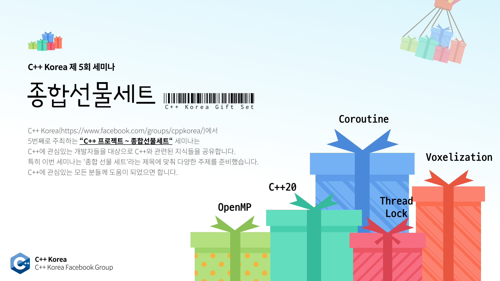

# C++ Korea 제5회 세미나 - "종합 선물 세트"

###### 2019년 4월 6일에 진행되었던 C++ Korea 5회 세미나 발표 자료 및 예제 코드

C++ Korea에서 5번째로 주최하는 "C++ 프로젝트 ~ 종합 선물 세트" 세미나는 C++에 관심있는 개발자들을 대상으로 C++와 관련된 지식들을 공유합니다. 특히 이번 세미나는 '종합 선물 세트'라는 제목에 맞춰 다양한 주제를 준비했습니다. C++에 관심있는 모든 분들께 도움이 되었으면 합니다.

## 신청 페이지

https://festa.io/events/226

## 프로그램

- 12시 - 13시 : 세미나 등록
- 13시 - 13시 10분 : 행사 소개
- 13시 10분 - 14시 20분 : 세션 1
- 14시 40분 - 15시 10분 : 세션 2
- 15시 10분 - 15시 40분 : 세션 3
- 15시 50분 - 17시 00분 : 세션 4
- 17시 10분 - 18시 20분 : 세션 5
- 18시 20분 - 18시 30분 : 경품 추첨 및 마무리

## 아젠다 및 발표자 소개

### 세션 1 - C++20 Key Features Summary

- 내용 : 모던 C++의 시초인 C++11은 C++ 코드 전반에 많은 변화를 가져왔습니다. 그리고 최근 C++20의 표준위원회 회의가 마무리되었습니다. 내년에 C++20이 도입되면 C++11이 처음 도입되었을 때와 비슷한 규모, 또는 그 이상의 변화가 있을 것이라고 예상하고 있습니다. C++20에는 Concepts, Contract, Ranges, Coroutine, Module 등 굵직한 기능 외에도 많은 기능들이 추가될 예정입니다. 이번 세션에서는 C++20에 추가될 주요 기능들을 살펴보고자 합니다.

- 강연자 : 옥찬호
    - 넥슨코리아 게임 프로그래머
    - Microsoft Developer Technologies MVP
    - C++ Korea 운영진

### 세션 2 - `shared_ptr<X>&`를 함수의 매개 변수로 사용하기

- 내용 : 함수의 매개 변수로 `shared_ptr<X>`나 `X*`가 아닌 `shared_ptr<X>&`를 쓰는 것이 바람직할까요? 본 강연에서는 `shared_ptr<X>&`를 언제 써도 되는지, 언제 써야 하는지, 언제 쓰지 말아야 할 지를 여러 예시들과 함께 설명합니다. 듣고 나서 여러분의 입사자 업무 매뉴얼에 넣으셔도 될 것입니다. 

- 강연자 : 배현직
    - 1995년부터 게임프로그래머 경력
    - 한국인 최초 Game Programming Gems 저술
    - 게임서버 개발 20년 경력, 3D 엔진 개발 4년 경력
    - 프라우드넷, 블리츠1941, 오즈 등 개발
    - 넷텐션 등 3개 회사 창업 경력

### 세션 3 - C++ 태스크 기반 병렬 프로그래밍

- 내용 : 병렬 컴퓨팅 방법론은 크게 루프 기반 병렬화와 태스크 기반 병렬화로 나뉩니다. 태스크 기반 병렬화는 더 섬세한 스케줄링을 통해 많은 경우 루프 기반 병렬화보다 뛰어난 병렬화 성능을 얻어낼 수 있습니다. 이 세션에서는 태스크 기반 병렬화와 루프 기반 병렬화를 비교하고, 태스크 기반 병렬화를 수행하는 방법을 간단히 설명합니다. 그리고 C++에서 태스크 기반 프로그래밍을 할 수 있는 OpenMP와 HPX 프레임워크를 소개합니다.

- 강연자 : 김규래
    - 서강대학교 전자공학과
    - 삼성서울병원 학부연구원

### 세션 4 - GPU를 이용한 복셀라이제이션

- 내용 : 그래픽스적인 편집 기능을 위해서, 혹은 복셀 기반 게임 개발을 위해서 폴리곤 베이스의 모델 데이터를 복셀 데이터로 변환해야할 경우가 있습니다. 폴리곤의 면에 교차하는 복셀 데이터를 만들어내는 것은 쉽습니다. 하지만 대부분의 경우 이렇게 면 데이터만이 변환된 복셀 데이터는 그다지 쓸모가 없습니다. 복셀 기반의 지형을 편집하는 등 실제로 복셀 데이터로 뭔가를 하기 위해서는 안이 꽉 채워진 이른바 solid 복셀 데이터가 필요합니다. 폴리곤 모델로부터 solid 복셀 데이터를 만드는 작업은 느립니다. 그럼에도 불구하고 결과물도 그다지 만족스럽지 않을 수 있습니다. GPU를 이용하면 비교적 빠른 속도로 폴리곤 데이터를 solid 복셀 데이터로 변환할 수 있습니다. 또한 품질도 원하는만큼 올릴 수 있습니다. 이 강연에서는 실제로 GPU를 이용해서 폴리곤 데이터를 복셀 데이터로 변환하는 방법을 설명합니다.

- 강연자 : 유영천
    - Corum Online, Luna Online 게임 엔진 및 서버/클라이언트 네트워크 라이브러리 개발
    - Project D Online 개발 및 서비스
    - 현재 Voxel기반 온라인 게임을 개발중인 1인 개발자

### 세션 5 - C++ Coroutine 알아보기: 접근법, 컴파일러, 그리고 이슈들

- 내용 : 표준 제안서의 내용을 기반으로 C++ Coroutine 의 의미구조와 문법에 대해 설명합니다. 컴파일러들의 차이와 발표자가 겪었던 이슈를 보면서 Coroutine을 적용하고 디버깅할 수 있는 지식을 갖출 수 있습니다.

- 강연자 : 박동하
    - C++ Korea 운영진
    - Alchera Inc. 전문연구원. 딥러닝을 위한 GPU 클러스터 개발

## 안내

- 본 행사는 사전 등록 하신 분에 한해 참석이 가능합니다.
- 행사 참석을 취소할 경우 1주일 전까지는 전액 환불이 가능하며, 이후에는 환불이 불가능합니다.
- 본 행사는 유료 행사이며, 참가비는 행사 준비 및 진행을 위해 사용될 예정입니다.
- 본 행사를 진행하는 동안 간단한 샌드위치와 다과를 준비할 예정입니다.
- 주차 공간이 제공되지 않으니 근처 유료 주차장에 주차하거나 대중교통을 이용해 주시기 바랍니다.

행사 관련 문의는 utilforever@gmail.com 으로 해주시기 바랍니다.

## 장소

한국마이크로소프트(더케이트윈타워 A동 11층) (주소명 : 서울특별시 종로구 종로1길 50 A동 11층)