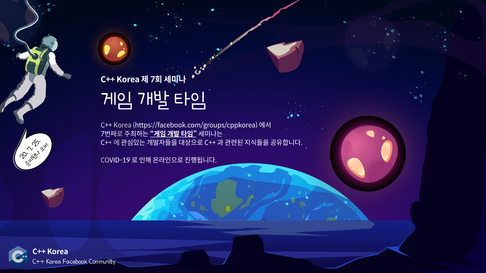

# C++ Korea 제7회 세미나 - "게임 개발 타임"

###### 2020년 7월 25일에 진행되었던 C++ Korea 7회 세미나 발표 자료 및 예제 코드

[C++ Korea](https://www.facebook.com/groups/cppkorea/)에서 7번째로 주최하는 "게임 개발 타임" 세미나는 C++으로 게임을 개발하는 분들을 위해 여러 지식들을 공유합니다.

## 신청 페이지

https://festa.io/events/1093

## 프로그램

- 13:00 ~ 13:10 : 행사 소개
- 13:10 ~ 14:00 : 세션 1 (게임 엔진 개발과 C++)
- 14:10 ~ 15:00 : 세션 2 (현실적인(Practical) CMake)
- 15:10 ~ 15:40 : 세션 3 (포인터를 사용하지 않고 게임 개발 해보기)
- 15:50 ~ 17:00 : 세션 4 (3D 게임에서의 빠른 렌더링을 위한 최적화 기법)

## 아젠다 및 발표자 소개

### 세션 1 - 게임 엔진 개발과 C++

C++로 게임 엔진을 개발하면서 적용한 다양한 기법들을 공유합니다.
이 발표를 통해 여러분은 더 빠르고 안전한 코드를 작성할 수 있게 됩니다.
게임 개발과 관련이 없는 분도 흥미롭게 들으실만한 내용으로 준비했습니다.

#### 대상

- 최적화에 관심이 있다
- 코드 품질을 높이고 싶다
- 나도 게임 엔진을 만들어보고 싶다

#### 내용

- 성능과 최적화
- 타입 시스템 활용
- 게임엔진 아키텍처

#### 발표자

- 이석진. https://github.com/Othereum
- 대덕소프웨어마이스터고등학교 재학생

### 세션 2 - 현실적인(Practical) CMake

빌드 시스템 생성기 CMake에 대해서 다룹니다. 발표 내용은 2가지 질문에 대한 답을 찾는 과정으로 구성됩니다.

- CMake에는 어떤 내용이 작성되어야 할까요?
- 언제, 어떻게, 어느 조건에서 CMake를 사용해야 할까요?

신입 개발자 혹은 입문자가 거부감없이 최신 버전의 CMake를 작성하기 위해 알아야 할 내용과 CMake가 C++ 프로젝트를 지원할때 어느 부분에서 복잡해지는지 그 과정을 살펴볼 수 있습니다.

#### 발표 내용 (개요)

- 참고자료 소개
- CLI, 함수 사용법
  - 모듈을 만들기(build) 위한 최소사항들
  - 프로젝트 생성
  - 설치(install)
- 빌드 절차 설계
  - CMake가 도와줄 수 있는 부분은 어디일까?
  - 외부(external) 모듈/패키지 가져오기
    - Conan
    - find_package + VcPkg
    - add_subdirectory
  - 패키징
    - find_package 지원
- CMake가 복잡해지는 이유들
  - 소스 코드와 빌드 설정의 상관관계
  - 플랫폼 대응
  - 컴파일러 대응
- (주관적) 가이드라인

#### 발표자

- 박동하. https://github.com/luncliff
- C++ Korea Facebook Group 운영진. LINE+ Yuki 팀.

### 세션 3 - 포인터를 사용하지 않고 게임 개발 해보기

최근 C++을 사용해 게임을 강화 학습 환경으로 만들면서 포인터와 관련해 여러 이슈를 겪었던 적이 있습니다. 강화 학습에서는 게임 상태를 수시로 복사해야 하기 때문입니다. 그러던 도중 '포인터를 사용하지 않고 게임을 만들어 보면 어떨까?'라는 생각이 들었습니다. 그래서 포인터를 사용하지 않고 게임을 만들어 보기로 했습니다. 이번 발표에서는 게임을 만드는 과정에서 포인터를 써야하는 순간들이 여럿 있었는데 이 부분을 어떤 방법으로 대체했는지, 포인터를 사용하지 않았을 때의 한계, 그리고 구현 및 버그 수정 과정에서 알게된 지식을 공유하고자 합니다.

#### 발표자

- 옥찬호. https://github.com/utilForever
- 넥슨코리아 게임 프로그래머
- Microsoft Developer Technologies MVP
- C++ Korea Facebook Group 운영진
- 번역서 : 게임샐러드로 코드 한 줄 없이 게임 만들기 (에이콘출판, 2013), 유니티 Shader와 Effect 제작 (에이콘출판, 2014), 2D 게임 프로그래밍 (에이콘출판, 2014), 러스트 핵심 노트 (한빛미디어, 2017), 모던 C++ 입문 (길벗, 2017), C++ 최적화 (한빛미디어, 2019)

### 세션 4 - 3D 게임에서의 빠른 렌더링을 위한 최적화 기법

3D게임에서 렌더링 속도를 높이는 방법은 '근본적으로는' 아주 간단합니다. 보이지 않은 오브젝트를 안그리면 됩니다. 그러나 임의의 오브젝트가 보일지 안보일지를 판별하기는 쉽지 않습니다. 기본적으로 맵에 존재하는 오브젝트들은 자료 구조상으로 의미있는 관계를 유지하고 있어야합니다. 이 발표는 1) 렌더링 성능을 올리기 위해 오브젝트들이 자료구조상으로 표현하는 방법과 2) 이것을 이용해서 빠르게 렌더링할 수 있는 방법 을 설명합니다. 앞부분에서는 깊게 다루진 않겠지만 참고가 될만한 과거에 많이 사용되었던 방법을 소개합니다. 중후반에서는 현재 실험하고 있는 2가지 기법, GPU를 이용한 PVS와 SW Occlusion Culling의 개요와 구현 방법을 설명합니다.

#### 발표자

- 유영천. https://megayuchi.com/
- Corum Online, Luna Online 게임 엔진 및 서버/클라이언트 네트워크 라이브러리 개발
- Project D Online 개발 및 서비스
- 현재 Voxel기반 온라인 게임을 개발중인 1인 개발자

## 안내

- 본 행사는 **온라인**으로 개최하며 비용은 **무료**입니다.
- 행사 이후 발표 자료 및 영상은 발표자의 의사에 따라 공개되지 않을 수 있습니다.

행사 관련 문의는 utilforever@gmail.com 으로 해주시기 바랍니다.
