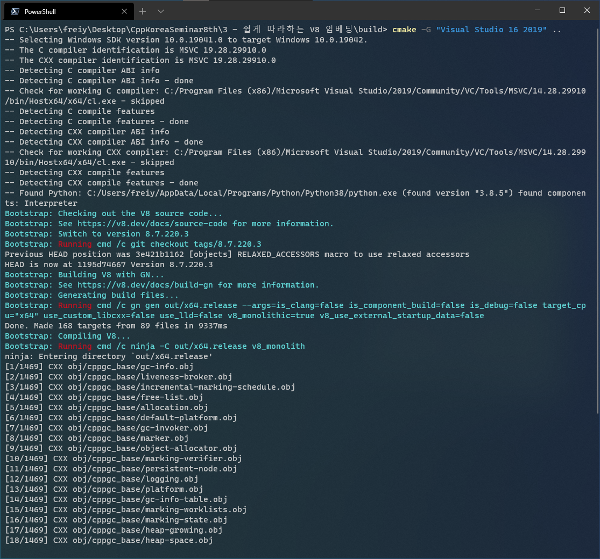
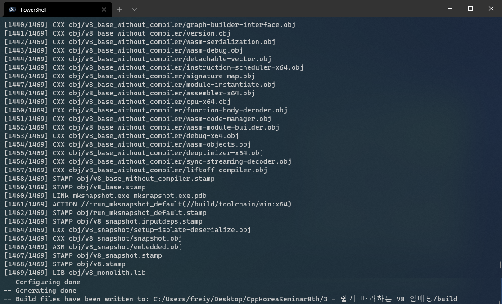
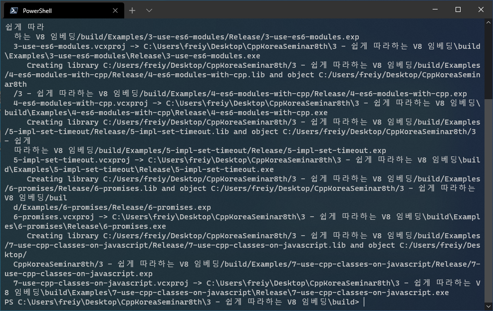

# 쉽게 따라하는 V8 임베딩

V8은 구글이 Chromium을 개발하면서 함께 개발한 자바스크립트 엔진입니다. 
Node.js 및 Deno와 같은 런타임을 개발하는데도 사용되었고, 크로스플렛폼을 지원합니다. 
이 발표에선 V8을 다운받아 빌드한 후, C++ 프로그램에 임베딩하는 방법을 소개합니다. 

## 목차

* V8 소개
* V8 소스코드 다운로드 및 빌드하는 법
* V8 링크하기
* 자바스크립트 소개
* [V8으로 자바스크립트 코드 실행하기](Examples/1-run-javascript/Source/Main.cc)
* [C++ 함수를 자바스크립트에 노출하기](Examples/2-expose-cpp-to-javascript/Source/Main.cc)
* [ES6 모듈 코드 실행하기](Examples/3-use-es6-modules/Source/Main.cc)
* [C++ 함수로 이루어진 ES6 모듈 만들기](Examples/4-es6-modules-with-cpp/Source/Main.cc)
* [setTimeout 구현하기](Examples/5-impl-set-timeout/Source/Main.cc)
* [자바스크립트 Promise 활용하기](Examples/6-promises/Source/Main.cc)
* [C++ 클래스를 자바스크립트에 노출하기](Examples/7-use-cpp-classes-on-javascript/Source/Main.cc)

## 예제 코드 빌드하기

**맥을 사용하시는 분들은 [주의 사항](#주의-사항)을 먼저 확인해주세요.**

빌드에는 다음 프로그램이 필요합니다.

윈도우에서:
* Visual Studio 2017/2019 with Desktop development with C++
* Debugging Tools for Windows
* Python 3
* CMake 3.13 이상

우분투에서:
* gcc 또는 clang
* Python 3
* Python 2.7
* CMake 3.13 이상

8차 세미나 git 저장소를 클론합니다.

```
git clone https://github.com/CppKorea/CppKoreaSeminar8th --recurse-submodules
cd "CppKoreaSeminar8th/3 - 쉽게 따라하는 V8 임베딩"
```

빌드 결과물을 저장할 디렉토리를 생성한 후, 빌드 시스템을 생성합니다. 빌드 시스템을 생성할 때 V8 빌드가 함께 이루어집니다. **이 과정은 컴퓨터에 따라 최대 몇 시간까지 걸릴 수 있습니다.** V8 빌드 중에는 빌드 시스템이 CPU를 모두 점유하기 때문에, 다른 작업에 지장을 줄 수 있습니다. 노트북이라면 충전기를 연결하여 절전모드를 해제한 상태에서 빌드해주세요. **V8 소스코드는 `~/v8` 에 다운로드 됩니다.**

```
cmake -G "e.g. Visual Studio 16 2019" -DCMAKE_BUILD_TYPE=Debug ..
```

위 과정이 모두 끝났다면, 콘솔에 다음과 비슷한 결과가 출력되어있어야 합니다. 이 과정에서 `v8_monolith`가 자동으로 빌드되며, 1400여개의 파일이 컴파일됩니다.





예제를 빌드합니다.

```
cmake --build .
```

빌드가 끝났다면, 다음과 비슷한 결과가 출력되어있어야 합니다. 이 과정에서 실행 파일들이 생성됩니다.



출력되는 결과는 플렛폼에 따라 달라질 수 있습니다.

### 릴리즈 모드로 빌드

릴리드 모드로 빌드하려면 다음과 같이 빌드 시스템을 생성합니다.

```
cmake -G "e.g. Visual Studio 16 2019" -DCMAKE_BUILD_TYPE=Release ..
```

윈도우에선 릴리즈 모드는 다음과 같이 빌드하여야 합니다.

```
cmake --build . --config Release
```

위 과정은 Visual Studio 등 CMake 프로젝트를 지원하는 IDE를 사용하면 쉽게 진행할 수 있습니다.

### 주의 사항

이 예제 코드는 **MSVC 14.28.29333**로 빌드되어, **Windows 10 20H2 (OS Build 19042.804)** 에서만 테스트되었습니다. 우분투에선 clang을 이용하면 V8 빌드까지는 가능하나, 아직 예제 코드를 테스트해보지 않았습니다. 예제가 발표 자료에 나와있는대로 작동하지 않는다면, `freiyer.paxbun@gmail.com` 으로 알려주시거나, 이 저장소로 PR을 주시면 정말 감사드리겠습니다. 그 외 데비안 기반이 아닌 리눅스에서 테스트해보셨는데 잘 돌아간다면, 위 이메일로 알려주세요.

**맥에선 V8 빌드가 진행되지 않습니다.** `Dependencies/v8-cmake/bootstrap/__main__.py`의 7번줄을 보시면 다음과 같이 되어있습니다.

```py
# Check platform
supported_os_list = ["win32", "linux"] # ["win32", "linux", "darwin"]
if sys.platform not in supported_os_list:
    print_colored("Fatal error: platform '{0}' is not supported".format(sys.platform))
    exit(1)
```

위 부분에서 `supported_os_list`의 값을 `["win32", "linux", "darwin"]`로 설정해주시면 `Fatal error: platform 'darwin' is not supported`라는 메시지는 표시되지 않겠지만, 테스트를 해보지 않아 V8 빌드에 실패할 가능성이 있습니다. 혹시 인텔 맥을 갖고 계신 분들 중에 `supported_os_list`에 `"darwin"`을 추가한 것만으로 V8 빌드에 성공하신 분들이 계시다면 마찬가지로 `freiyer.paxbun@gmail.com`으로 알려주시거나, [paxbun/v8-cmake](https://github.com/paxbun/v8-cmake)로 PR 주시면 감사드리겠습니다.

애플 실리콘 맥을 갖고 계신 분들께서는 `CMakeLists.txt`의 23번줄을 확인해주세요.

```cmake
set(V8_IS_COMPONENT_BUILD OFF)
set(V8_TARGET_CPU "x64")
set(V8_USE_CUSTOM_LIBCXX OFF)
```

여기서 `V8_TARGET_CPU`가 `"x64"`가 아닐텐데, 이것도 무슨 값이 되어야하는지 아직 확인되지 않았습니다. 혹시 발표자료에 나온 `gn args` 명령어로 이를 확인하실 수 있는 분이 계시다면, `freiyer.paxbun@gmail.com`으로 알려주시거나, [paxbun/v8-cmake](https://github.com/paxbun/v8-cmake)로 PR 주시면 감사드리겠습니다.

만약 위 방법으로도 CMake가 자동으로 V8을 빌드해주지 않는다면, [V8 공식 홈페이지](https://v8.dev)를 참고해주세요. 불편을 끼쳐드려 죄송합니다.

이 이슈외에 다른 오류가 발생한다면 언제든지 `freiyer.paxbun@gmail.com`으로 메일 보내주시거나, [paxbun/v8-cmake](https://github.com/paxbun/v8-cmake)에 이슈를 보내주세요.

# License

## [Examples](Examples), [.clang-format](.clang-format), and [CMakeLists.txt](CMakeLists.txt)


Licensed under the [MIT License](https://opensource.org/licenses/MIT).

Copyright (c) 2021 Chanjung Kim

Permission is hereby granted, free of charge, to any person obtaining a copy of this software and associated documentation files (the "Software"), to deal in the Software without restriction, including without limitation the rights to use, copy, modify, merge, publish, distribute, sublicense, and/or sell copies of the Software, and to permit persons to whom the Software is furnished to do so, subject to the following conditions:

The above copyright notice and this permission notice shall be included in all copies or substantial portions of the Software.

THE SOFTWARE IS PROVIDED "AS IS", WITHOUT WARRANTY OF ANY KIND, EXPRESS OR IMPLIED, INCLUDING BUT NOT LIMITED TO THE WARRANTIES OF MERCHANTABILITY, FITNESS FOR A PARTICULAR PURPOSE AND NONINFRINGEMENT. IN NO EVENT SHALL THE AUTHORS OR COPYRIGHT HOLDERS BE LIABLE FOR ANY CLAIM, DAMAGES OR OTHER
LIABILITY, WHETHER IN AN ACTION OF CONTRACT, TORT OR OTHERWISE, ARISING FROM, OUT OF OR IN CONNECTION WITH THE SOFTWARE OR THE USE OR OTHER DEALINGS IN THE SOFTWARE.

## V8


Licensed under the [3-Clause BSD License](https://opensource.org/licenses/BSD-3-Clause).

Copyright 2006-2011, the V8 project authors. All rights reserved.

Redistribution and use in source and binary forms, with or without modification, are permitted provided that the following conditions are met:

* Redistributions of source code must retain the above copyright notice, this list of conditions and the following disclaimer.
* Redistributions in binary form must reproduce the above copyright notice, this list of conditions and the following disclaimer in the documentation and/or other materials provided with the distribution.
* Neither the name of Google Inc. nor the names of its contributors may be used to endorse or promote products derived from this software without specific prior written permission.

THIS SOFTWARE IS PROVIDED BY THE COPYRIGHT HOLDERS AND CONTRIBUTORS "AS IS" AND ANY EXPRESS OR IMPLIED WARRANTIES, INCLUDING, BUT NOT LIMITED TO, THE IMPLIED WARRANTIES OF MERCHANTABILITY AND FITNESS FOR A PARTICULAR PURPOSE ARE DISCLAIMED. IN NO EVENT SHALL THE COPYRIGHT OWNER OR CONTRIBUTORS BE LIABLE FOR ANY DIRECT, INDIRECT, INCIDENTAL, SPECIAL, EXEMPLARY, OR CONSEQUENTIAL DAMAGES (INCLUDING, BUT NOT LIMITED TO, PROCUREMENT OF SUBSTITUTE GOODS OR SERVICES; LOSS OF USE, DATA, OR PROFITS; OR BUSINESS INTERRUPTION) HOWEVER CAUSED AND ON ANY THEORY OF LIABILITY, WHETHER IN CONTRACT, STRICT LIABILITY, OR TORT (INCLUDING NEGLIGENCE OR OTHERWISE) ARISING IN ANY WAY OUT OF THE USE OF THIS SOFTWARE, EVEN IF ADVISED OF THE POSSIBILITY OF SUCH DAMAGE.