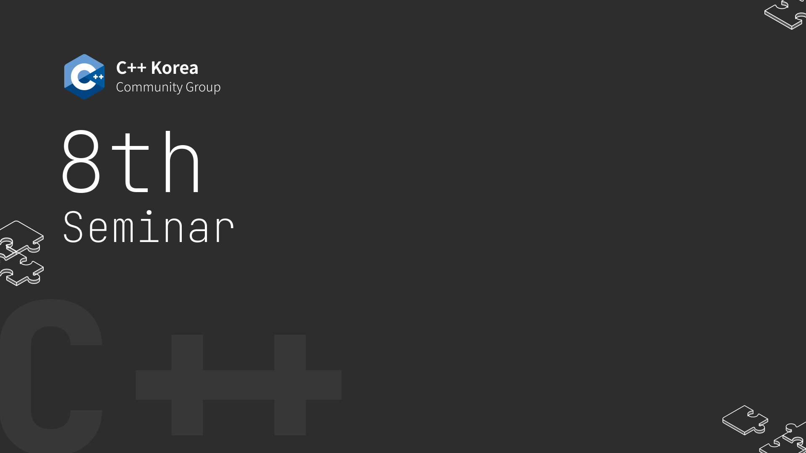

# C++ Korea 제8회 세미나

###### 2021년 3월 20일에 진행되었던 C++ Korea 8회 세미나 발표 자료 및 예제 코드

[C++ Korea](https://www.facebook.com/groups/cppkorea/)에서 8번째로 주최하는 세미나는 C++을 사용하는 다양한 분야에 관해 여러 지식들을 공유합니다.

## 세미나 영상 다시 보기

https://www.youtube.com/embed/5ePdbjnfYLs

## 프로그램

- 02:21~ : 세션 1 (POCO 라이브러리를 사용한 채팅 서버 개발)
- 1:13:25~ : 세션 2 (C++로 구현하는 ML Framework)
- 2:05:41~ : 세션 3 (C++ Modules 실무활용 언리쉬드)
- 3:03:01~ : 세션 4 (쉽게 따라하는 V8 임베딩)

## 아젠다 및 발표자 소개

### 세션 1 - POCO 라이브러리를 사용한 채팅 서버 개발

오픈 소스 라이브러리 POCO를 사용하여 크로스 플랫폼을 지원하는 채팅 서버를 개발하는 방법을 설명합니다.
POCO의 네트워크, Redis 등 다양한 라이브러리를 잘 활용하면 C++가 타 언어에 비해서 생산성이 떨어지는 단점을 보완하면서 고성능 서버를 쉽게 만들 수 있습니다.

#### 대상

- 최적화에 관심이 있다
- 코드 품질을 높이고 싶다
- 나도 게임 엔진을 만들어보고 싶다

#### 내용

- 성능과 최적화
- 타입 시스템 활용
- 게임엔진 아키텍처

#### 발표자

- 최흥배.

### 세션 2 - C++로 구현하는 ML Framework

C++ 로 딥러닝 프레임워크를 구현하며 겪은 시행착오와 과정을 소개합니다. 유저 인터페이스 디자인부터 그래프 구현, 하드웨어를 고려한 연산 최적화까지 다양한 부분에 대해 전반적인 내용을 다룹니다.
C++ 에서 파이썬처럼 편리하게 딥러닝 프로젝트를 할 수 있도록 편리한 사용성과 확장성, 뛰어난 성능을 위해 필요했던 고민들, 구현하면서 배우게 된 점과 경험들을 세미나를 통해 모두와 공유하고 싶습니다. 또한 앞으로 C++ 기반 딥러닝 프레임워크의 발전 방향에 대한 생각을 공유하고 의견을 나누어보려 합니다.

#### 발표 내용 (개요)

- 참고자료 소개
- CLI, 함수 사용법
  - 모듈을 만들기(build) 위한 최소사항들
  - 프로젝트 생성
  - 설치(install)
- 빌드 절차 설계
  - CMake가 도와줄 수 있는 부분은 어디일까?
  - 외부(external) 모듈/패키지 가져오기
    - Conan
    - find_package + VcPkg
    - add_subdirectory
  - 패키징
    - find_package 지원
- CMake가 복잡해지는 이유들
  - 소스 코드와 빌드 설정의 상관관계
  - 플랫폼 대응
  - 컴파일러 대응
- (주관적) 가이드라인

#### 발표자

- 김재우.

### 세션 3 - C++ Modules 실무활용 언리쉬드

Modules는 C++20의 4대 대박 업데이트 중에서도 편의성에 있어 개발자들의 체감도가 가장 높을 만한 단연코 가장 주목받고 있는 개념입니다. 그동안 최신 컴파일러를 통해 코스상에서만 모듈을 사용할 수 있었지만, VS2019 16.8 버전부터 개발 툴의 전폭적인 지원을 받게 됨에 따라 본격적으로 실무에서 활용할 수 있는 환경이 만들어졌습니다. Modules에 대한 기본적인 내용부터 IDE를 활용해 개발하는 실무까지 실습과 함께 익혀보는 시간을 갖도록 하겠습니다.

#### 발표자

- 제이슨 김. drvoss@gmail.com

### 세션 4 - 쉽게 따라하는 V8 임베딩

V8은 구글이 Chromium을 개발하면서 함께 개발한 자바스크립트 엔진입니다. Node.js 및 Deno와 같은 런타임을 개발하는데도 사용되었고, 크로스플렛폼을 지원합니다. 이 발표에선 V8을 다운받아 빌드한 후, C++ 프로그램에 임베딩하는 방법을 소개합니다.

* V8 소개
* V8 소스코드 다운로드 및 빌드하는 법
* V8 링크하기
* 자바스크립트 소개
* V8으로 자바스크립트 코드 실행하기
* C++ 함수를 자바스크립트에 노출하기
* ES6 모듈 코드 실행하기
* C++ 함수로 이루어진 ES6 모듈 만들기
* setTimeout 구현하기
* 자바스크립트 Promise 활용하기
* C++ 클래스를 자바스크립트에 노출하기
* v8pp로 C++ 클래스를 자바스크립트에 노출하기

#### 발표자

- 김찬중. freiyer.paxbun@gmail.com
- DGIST 기초학부 재학중
- https://github.com/paxbun

## 안내

- 본 행사는 **온라인**으로 개최하며 비용은 **무료**입니다.
- 행사 이후 발표 자료 및 영상은 발표자의 의사에 따라 공개되지 않을 수 있습니다.

행사 관련 문의는 utilforever@gmail.com 으로 해주시기 바랍니다.
